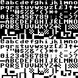
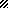
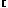
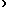
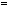
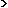

# C64 Character Table And Charset Layout

This file explains how the C64 character set is laid out in memory and how a custom character set is usually built or replaced.

It focuses on character **slots** and **glyph memory**, because those are the things that matter most when building or replacing a charset.

Important reminder:

- `PETSCII`, `screen codes`, and `character slots` are related, but not identical
- screen RAM stores screen codes
- the character set provides the 8x8 glyph data for slots `0-255`
- the asset links below come from captured `128x128` sheets for both built-in ROM display sets

## Character Set Format

A normal C64 character set is:

- `256` character slots
- `8` bytes per character
- `2048` bytes total

## Character Cell Size

Each character cell is:

- `8x8` pixels
- `1` bit per pixel

Each character slot uses:

- `8` bytes
- `1` byte per row

## Row Format

Within one glyph:

- byte `0` = top row
- byte `1` = next row
- ...
- byte `7` = bottom row

Within each byte:

- bit `7` = left-most pixel
- bit `0` = right-most pixel

## Character Slot Order

Slots are stored sequentially:

- slot `0` occupies bytes `0-7`
- slot `1` occupies bytes `8-15`
- slot `2` occupies bytes `16-23`
- and so on

Memory formula:

- `glyph address = base + (slot * 8)`

## Alignment And Placement

A character set is normally placed in a contiguous `2 KB` block aligned to a `2 KB` boundary.

Examples of valid bases:

- `$0000`
- `$0800`
- `$1000`
- `$1800`
- `$2000`
- `$2800`
- `$3000`
- `$3800`

In practice, the VIC must also be able to see the charset in the currently selected VIC bank.

## Built-In Character ROM

The built-in character ROM is `4 KB`, which contains two `2 KB` character sets:

- unshifted set: uppercase/graphics
- shifted set: upper/lowercase, also called business mode

The visible glyph appearance depends on which built-in set is active.

When people talk about “the C64 character table,” they may mean:

- PETSCII input codes
- screen codes
- character slot numbers
- ROM glyph shapes

This page is mainly about **character slot numbers and glyph memory addresses**.

## Replacing The Character Set

The normal workflow for a custom charset is:

1. copy the built-in character set from ROM into RAM, or start from a blank 2 KB buffer
2. edit the 8 bytes for any slots you want to change
3. point the VIC at the RAM-based charset

Typical reasons to copy ROM first:

- preserve letters and punctuation
- only customize a few symbols
- use the stock set as a starting point

Typical reasons to start blank:

- fully custom art
- game tiles
- page/image-specific character maps

## How The VIC Uses It

The VIC reads character glyphs using:

- the current VIC bank
- the character-memory pointer setup

That means replacing the charset usually involves:

- placing the 2 KB charset in RAM inside the active VIC bank
- adjusting the VIC memory-pointer register so the VIC reads from that base

For related addressing details, see:

- [memory-map.md](memory-map.md)
- [notes/banking.md](notes/banking.md)

## Asset Sets

Current captured asset sets:

[unshifted sheet](assets/charset-unshifted/sheet-128.png)

[shifted business-mode sheet](assets/charset-shifted-business/sheet-128.png)

## Printable / Label Columns

The table below uses a practical slot-label approach:

- common text-range characters are named directly
- graphics-heavy ranges are labeled like `GFX 64`
- reverse-video slots are labeled `REV ...`
- when shifted/business mode shows a different visible character, the label is written as `unshifted / shifted`

| Dec | Hex | Printable / Label | Offset | Unshifted | Shifted / Business |
| --- | --- | --- | --- | --- | --- |
 | 0 | `$00` | @ | `$0000` |  |  | 
 | 1 | `$01` | A / a | `$0008` |  |  | 
 | 2 | `$02` | B / b | `$0010` |  |  | 
 | 3 | `$03` | C / c | `$0018` |  |  | 
 | 4 | `$04` | D / d | `$0020` |  |  | 
 | 5 | `$05` | E / e | `$0028` |  |  | 
 | 6 | `$06` | F / f | `$0030` |  |  | 
 | 7 | `$07` | G / g | `$0038` |  |  | 
 | 8 | `$08` | H / h | `$0040` |  |  | 
 | 9 | `$09` | I / i | `$0048` |  |  | 
 | 10 | `$0A` | J / j | `$0050` |  |  | 
 | 11 | `$0B` | K / k | `$0058` |  |  | 
 | 12 | `$0C` | L / l | `$0060` |  |  | 
 | 13 | `$0D` | M / m | `$0068` |  |  | 
 | 14 | `$0E` | N / n | `$0070` |  |  | 
 | 15 | `$0F` | O / o | `$0078` |  |  | 
 | 16 | `$10` | P / p | `$0080` |  |  | 
 | 17 | `$11` | Q / q | `$0088` |  |  | 
 | 18 | `$12` | R / r | `$0090` |  |  | 
 | 19 | `$13` | S / s | `$0098` |  |  | 
 | 20 | `$14` | T / t | `$00A0` |  |  | 
 | 21 | `$15` | U / u | `$00A8` |  |  | 
 | 22 | `$16` | V / v | `$00B0` |  |  | 
 | 23 | `$17` | W / w | `$00B8` |  |  | 
 | 24 | `$18` | X / x | `$00C0` |  |  | 
 | 25 | `$19` | Y / y | `$00C8` |  |  | 
 | 26 | `$1A` | Z / z | `$00D0` |  |  | 
 | 27 | `$1B` | [ | `$00D8` |  |  | 
 | 28 | `$1C` | GBP | `$00E0` |  |  | 
 | 29 | `$1D` | ] | `$00E8` |  |  | 
 | 30 | `$1E` | ^ | `$00F0` |  |  | 
 | 31 | `$1F` | LEFT | `$00F8` |  |  | 
 | 32 | `$20` | SPACE | `$0100` |  |  | 
 | 33 | `$21` | ! | `$0108` |  |  | 
 | 34 | `$22` | " | `$0110` |  |  | 
 | 35 | `$23` | # | `$0118` |  |  | 
 | 36 | `$24` | $ | `$0120` |  |  | 
 | 37 | `$25` | % | `$0128` |  |  | 
 | 38 | `$26` | & | `$0130` |  |  | 
 | 39 | `$27` | ' | `$0138` |  |  | 
 | 40 | `$28` | ( | `$0140` |  |  | 
 | 41 | `$29` | ) | `$0148` |  |  | 
 | 42 | `$2A` | * | `$0150` |  |  | 
 | 43 | `$2B` | + | `$0158` |  |  | 
 | 44 | `$2C` | , | `$0160` |  |  | 
 | 45 | `$2D` | - | `$0168` |  |  | 
 | 46 | `$2E` | . | `$0170` |  |  | 
 | 47 | `$2F` | / | `$0178` |  |  | 
 | 48 | `$30` | 0 | `$0180` |  |  | 
 | 49 | `$31` | 1 | `$0188` |  |  | 
 | 50 | `$32` | 2 | `$0190` |  |  | 
 | 51 | `$33` | 3 | `$0198` |  |  | 
 | 52 | `$34` | 4 | `$01A0` |  |  | 
 | 53 | `$35` | 5 | `$01A8` |  |  | 
 | 54 | `$36` | 6 | `$01B0` |  |  | 
 | 55 | `$37` | 7 | `$01B8` |  |  | 
 | 56 | `$38` | 8 | `$01C0` |  |  | 
 | 57 | `$39` | 9 | `$01C8` |  |  | 
 | 58 | `$3A` | : | `$01D0` |  |  | 
 | 59 | `$3B` | ; | `$01D8` |  |  | 
 | 60 | `$3C` | < | `$01E0` |  |  | 
 | 61 | `$3D` | = | `$01E8` |  |  | 
 | 62 | `$3E` | > | `$01F0` |  |  | 
 | 63 | `$3F` | ? | `$01F8` |  |  | 
 | 64 | `$40` | GFX 64 / @ | `$0200` |  |  | 
 | 65 | `$41` | GFX 65 / A | `$0208` |  |  | 
 | 66 | `$42` | GFX 66 / B | `$0210` |  |  | 
 | 67 | `$43` | GFX 67 / C | `$0218` |  |  | 
 | 68 | `$44` | GFX 68 / D | `$0220` |  |  | 
 | 69 | `$45` | GFX 69 / E | `$0228` |  |  | 
 | 70 | `$46` | GFX 70 / F | `$0230` |  |  | 
 | 71 | `$47` | GFX 71 / G | `$0238` |  |  | 
 | 72 | `$48` | GFX 72 / H | `$0240` |  |  | 
 | 73 | `$49` | GFX 73 / I | `$0248` |  |  | 
 | 74 | `$4A` | GFX 74 / J | `$0250` |  |  | 
 | 75 | `$4B` | GFX 75 / K | `$0258` |  |  | 
 | 76 | `$4C` | GFX 76 / L | `$0260` |  |  | 
 | 77 | `$4D` | GFX 77 / M | `$0268` |  |  | 
 | 78 | `$4E` | GFX 78 / N | `$0270` |  |  | 
 | 79 | `$4F` | GFX 79 / O | `$0278` |  |  | 
 | 80 | `$50` | GFX 80 / P | `$0280` |  |  | 
 | 81 | `$51` | GFX 81 / Q | `$0288` |  |  | 
 | 82 | `$52` | GFX 82 / R | `$0290` |  |  | 
 | 83 | `$53` | GFX 83 / S | `$0298` |  |  | 
 | 84 | `$54` | GFX 84 / T | `$02A0` |  |  | 
 | 85 | `$55` | GFX 85 / U | `$02A8` |  |  | 
 | 86 | `$56` | GFX 86 / V | `$02B0` |  |  | 
 | 87 | `$57` | GFX 87 / W | `$02B8` |  |  | 
 | 88 | `$58` | GFX 88 / X | `$02C0` |  |  | 
 | 89 | `$59` | GFX 89 / Y | `$02C8` |  |  | 
 | 90 | `$5A` | GFX 90 / Z | `$02D0` |  |  | 
 | 91 | `$5B` | GFX 91 / [ | `$02D8` |  |  | 
 | 92 | `$5C` | GFX 92 / GBP | `$02E0` |  |  | 
 | 93 | `$5D` | GFX 93 / ] | `$02E8` |  |  | 
 | 94 | `$5E` | GFX 94 / ^ | `$02F0` |  |  | 
 | 95 | `$5F` | GFX 95 / LEFT | `$02F8` |  |  | 
 | 96 | `$60` | GFX 96 | `$0300` |  |  | 
 | 97 | `$61` | GFX 97 | `$0308` |  |  | 
 | 98 | `$62` | GFX 98 | `$0310` |  |  | 
 | 99 | `$63` | GFX 99 | `$0318` |  |  | 
 | 100 | `$64` | GFX 100 | `$0320` |  |  | 
 | 101 | `$65` | GFX 101 | `$0328` |  |  | 
 | 102 | `$66` | GFX 102 | `$0330` |  |  | 
 | 103 | `$67` | GFX 103 | `$0338` |  |  | 
 | 104 | `$68` | GFX 104 | `$0340` |  |  | 
 | 105 | `$69` | GFX 105 | `$0348` |  |  | 
 | 106 | `$6A` | GFX 106 | `$0350` |  |  | 
 | 107 | `$6B` | GFX 107 | `$0358` |  |  | 
 | 108 | `$6C` | GFX 108 | `$0360` |  |  | 
 | 109 | `$6D` | GFX 109 | `$0368` |  |  | 
 | 110 | `$6E` | GFX 110 | `$0370` |  |  | 
 | 111 | `$6F` | GFX 111 | `$0378` |  |  | 
 | 112 | `$70` | GFX 112 | `$0380` |  |  | 
 | 113 | `$71` | GFX 113 | `$0388` |  |  | 
 | 114 | `$72` | GFX 114 | `$0390` |  |  | 
 | 115 | `$73` | GFX 115 | `$0398` |  |  | 
 | 116 | `$74` | GFX 116 | `$03A0` |  |  | 
 | 117 | `$75` | GFX 117 | `$03A8` |  |  | 
 | 118 | `$76` | GFX 118 | `$03B0` |  |  | 
 | 119 | `$77` | GFX 119 | `$03B8` |  |  | 
 | 120 | `$78` | GFX 120 | `$03C0` |  |  | 
 | 121 | `$79` | GFX 121 | `$03C8` |  |  | 
 | 122 | `$7A` | GFX 122 | `$03D0` |  |  | 
 | 123 | `$7B` | GFX 123 | `$03D8` |  |  | 
 | 124 | `$7C` | GFX 124 | `$03E0` |  |  | 
 | 125 | `$7D` | GFX 125 | `$03E8` |  |  | 
 | 126 | `$7E` | GFX 126 | `$03F0` |  |  | 
 | 127 | `$7F` | GFX 127 | `$03F8` |  |  | 
 | 128 | `$80` | REV @ | `$0400` |  |  | 
 | 129 | `$81` | REV A / REV a | `$0408` |  |  | 
 | 130 | `$82` | REV B / REV b | `$0410` |  |  | 
 | 131 | `$83` | REV C / REV c | `$0418` |  |  | 
 | 132 | `$84` | REV D / REV d | `$0420` |  |  | 
 | 133 | `$85` | REV E / REV e | `$0428` |  |  | 
 | 134 | `$86` | REV F / REV f | `$0430` |  |  | 
 | 135 | `$87` | REV G / REV g | `$0438` |  |  | 
 | 136 | `$88` | REV H / REV h | `$0440` |  |  | 
 | 137 | `$89` | REV I / REV i | `$0448` |  |  | 
 | 138 | `$8A` | REV J / REV j | `$0450` |  |  | 
 | 139 | `$8B` | REV K / REV k | `$0458` |  |  | 
 | 140 | `$8C` | REV L / REV l | `$0460` |  |  | 
 | 141 | `$8D` | REV M / REV m | `$0468` |  |  | 
 | 142 | `$8E` | REV N / REV n | `$0470` |  |  | 
 | 143 | `$8F` | REV O / REV o | `$0478` |  |  | 
 | 144 | `$90` | REV P / REV p | `$0480` |  |  | 
 | 145 | `$91` | REV Q / REV q | `$0488` |  |  | 
 | 146 | `$92` | REV R / REV r | `$0490` |  |  | 
 | 147 | `$93` | REV S / REV s | `$0498` |  |  | 
 | 148 | `$94` | REV T / REV t | `$04A0` |  |  | 
 | 149 | `$95` | REV U / REV u | `$04A8` |  |  | 
 | 150 | `$96` | REV V / REV v | `$04B0` |  |  | 
 | 151 | `$97` | REV W / REV w | `$04B8` |  |  | 
 | 152 | `$98` | REV X / REV x | `$04C0` |  |  | 
 | 153 | `$99` | REV Y / REV y | `$04C8` |  |  | 
 | 154 | `$9A` | REV Z / REV z | `$04D0` |  |  | 
 | 155 | `$9B` | REV [ | `$04D8` |  |  | 
 | 156 | `$9C` | REV GBP | `$04E0` |  |  | 
 | 157 | `$9D` | REV ] | `$04E8` |  |  | 
 | 158 | `$9E` | REV ^ | `$04F0` |  |  | 
 | 159 | `$9F` | REV LEFT | `$04F8` |  |  | 
 | 160 | `$A0` | REV SPACE | `$0500` |  |  | 
 | 161 | `$A1` | REV ! | `$0508` |  |  | 
 | 162 | `$A2` | REV " | `$0510` |  |  | 
 | 163 | `$A3` | REV # | `$0518` |  |  | 
 | 164 | `$A4` | REV $ | `$0520` |  |  | 
 | 165 | `$A5` | REV % | `$0528` |  |  | 
 | 166 | `$A6` | REV & | `$0530` |  |  | 
 | 167 | `$A7` | REV ' | `$0538` |  |  | 
 | 168 | `$A8` | REV ( | `$0540` |  |  | 
 | 169 | `$A9` | REV ) | `$0548` |  |  | 
 | 170 | `$AA` | REV * | `$0550` |  |  | 
 | 171 | `$AB` | REV + | `$0558` |  |  | 
 | 172 | `$AC` | REV , | `$0560` |  |  | 
 | 173 | `$AD` | REV - | `$0568` |  |  | 
 | 174 | `$AE` | REV . | `$0570` |  |  | 
 | 175 | `$AF` | REV / | `$0578` |  |  | 
 | 176 | `$B0` | REV 0 | `$0580` |  |  | 
 | 177 | `$B1` | REV 1 | `$0588` |  |  | 
 | 178 | `$B2` | REV 2 | `$0590` |  |  | 
 | 179 | `$B3` | REV 3 | `$0598` |  |  | 
 | 180 | `$B4` | REV 4 | `$05A0` |  |  | 
 | 181 | `$B5` | REV 5 | `$05A8` |  |  | 
 | 182 | `$B6` | REV 6 | `$05B0` |  |  | 
 | 183 | `$B7` | REV 7 | `$05B8` |  |  | 
 | 184 | `$B8` | REV 8 | `$05C0` |  |  | 
 | 185 | `$B9` | REV 9 | `$05C8` |  |  | 
 | 186 | `$BA` | REV : | `$05D0` |  |  | 
 | 187 | `$BB` | REV ; | `$05D8` |  |  | 
 | 188 | `$BC` | REV < | `$05E0` |  |  | 
 | 189 | `$BD` | REV = | `$05E8` |  |  | 
 | 190 | `$BE` | REV > | `$05F0` |  |  | 
 | 191 | `$BF` | REV ? | `$05F8` |  |  | 
 | 192 | `$C0` | REV GFX 64 / REV @ | `$0600` |  |  | 
 | 193 | `$C1` | REV GFX 65 / REV A | `$0608` |  |  | 
 | 194 | `$C2` | REV GFX 66 / REV B | `$0610` |  |  | 
 | 195 | `$C3` | REV GFX 67 / REV C | `$0618` |  |  | 
 | 196 | `$C4` | REV GFX 68 / REV D | `$0620` |  |  | 
 | 197 | `$C5` | REV GFX 69 / REV E | `$0628` |  |  | 
 | 198 | `$C6` | REV GFX 70 / REV F | `$0630` |  |  | 
 | 199 | `$C7` | REV GFX 71 / REV G | `$0638` |  |  | 
 | 200 | `$C8` | REV GFX 72 / REV H | `$0640` |  |  | 
 | 201 | `$C9` | REV GFX 73 / REV I | `$0648` |  |  | 
 | 202 | `$CA` | REV GFX 74 / REV J | `$0650` |  |  | 
 | 203 | `$CB` | REV GFX 75 / REV K | `$0658` |  |  | 
 | 204 | `$CC` | REV GFX 76 / REV L | `$0660` |  |  | 
 | 205 | `$CD` | REV GFX 77 / REV M | `$0668` |  |  | 
 | 206 | `$CE` | REV GFX 78 / REV N | `$0670` |  |  | 
 | 207 | `$CF` | REV GFX 79 / REV O | `$0678` |  |  | 
 | 208 | `$D0` | REV GFX 80 / REV P | `$0680` |  |  | 
 | 209 | `$D1` | REV GFX 81 / REV Q | `$0688` |  |  | 
 | 210 | `$D2` | REV GFX 82 / REV R | `$0690` |  |  | 
 | 211 | `$D3` | REV GFX 83 / REV S | `$0698` |  |  | 
 | 212 | `$D4` | REV GFX 84 / REV T | `$06A0` |  |  | 
 | 213 | `$D5` | REV GFX 85 / REV U | `$06A8` |  |  | 
 | 214 | `$D6` | REV GFX 86 / REV V | `$06B0` |  |  | 
 | 215 | `$D7` | REV GFX 87 / REV W | `$06B8` |  |  | 
 | 216 | `$D8` | REV GFX 88 / REV X | `$06C0` |  |  | 
 | 217 | `$D9` | REV GFX 89 / REV Y | `$06C8` |  |  | 
 | 218 | `$DA` | REV GFX 90 / REV Z | `$06D0` |  |  | 
 | 219 | `$DB` | REV GFX 91 / REV [ | `$06D8` |  |  | 
 | 220 | `$DC` | REV GFX 92 / REV GBP | `$06E0` |  |  | 
 | 221 | `$DD` | REV GFX 93 / REV ] | `$06E8` |  |  | 
 | 222 | `$DE` | REV GFX 94 / REV ^ | `$06F0` |  |  | 
 | 223 | `$DF` | REV GFX 95 / REV LEFT | `$06F8` |  |  | 
 | 224 | `$E0` | REV GFX 96 | `$0700` |  |  | 
 | 225 | `$E1` | REV GFX 97 | `$0708` |  |  | 
 | 226 | `$E2` | REV GFX 98 | `$0710` |  |  | 
 | 227 | `$E3` | REV GFX 99 | `$0718` |  |  | 
 | 228 | `$E4` | REV GFX 100 | `$0720` |  |  | 
 | 229 | `$E5` | REV GFX 101 | `$0728` |  |  | 
 | 230 | `$E6` | REV GFX 102 | `$0730` |  |  | 
 | 231 | `$E7` | REV GFX 103 | `$0738` |  |  | 
 | 232 | `$E8` | REV GFX 104 | `$0740` |  |  | 
 | 233 | `$E9` | REV GFX 105 | `$0748` |  |  | 
 | 234 | `$EA` | REV GFX 106 | `$0750` |  |  | 
 | 235 | `$EB` | REV GFX 107 | `$0758` |  |  | 
 | 236 | `$EC` | REV GFX 108 | `$0760` |  |  | 
 | 237 | `$ED` | REV GFX 109 | `$0768` |  |  | 
 | 238 | `$EE` | REV GFX 110 | `$0770` |  |  | 
 | 239 | `$EF` | REV GFX 111 | `$0778` |  |  | 
 | 240 | `$F0` | REV GFX 112 | `$0780` |  |  | 
 | 241 | `$F1` | REV GFX 113 | `$0788` |  |  | 
 | 242 | `$F2` | REV GFX 114 | `$0790` |  |  | 
 | 243 | `$F3` | REV GFX 115 | `$0798` |  |  | 
 | 244 | `$F4` | REV GFX 116 | `$07A0` |  |  | 
 | 245 | `$F5` | REV GFX 117 | `$07A8` |  |  | 
 | 246 | `$F6` | REV GFX 118 | `$07B0` |  |  | 
 | 247 | `$F7` | REV GFX 119 | `$07B8` |  |  | 
 | 248 | `$F8` | REV GFX 120 | `$07C0` |  |  | 
 | 249 | `$F9` | REV GFX 121 | `$07C8` |  |  | 
 | 250 | `$FA` | REV GFX 122 | `$07D0` |  |  | 
 | 251 | `$FB` | REV GFX 123 | `$07D8` |  |  | 
 | 252 | `$FC` | REV GFX 124 | `$07E0` |  |  | 
 | 253 | `$FD` | REV GFX 125 | `$07E8` |  |  | 
 | 254 | `$FE` | REV GFX 126 | `$07F0` |  |  | 
 | 255 | `$FF` | REV GFX 127 | `$07F8` |  |  | 

## Related Docs

- [notes/character-glyphs.md](notes/character-glyphs.md)
- [memory-map.md](memory-map.md)
- [glossary.md](glossary.md)
