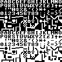
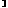
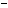
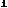

# C64 Character Table And Charset Layout

This file explains how the C64 character set is laid out in memory and how a custom character set is usually built or replaced.

It focuses on character **slots** and **glyph memory**, because those are the things that matter most when building or replacing a charset.

Important reminder:

- `PETSCII`, `screen codes`, and `character slots` are related, but not identical
- screen RAM stores screen codes
- the character set provides the 8x8 glyph data for slots `0-255`
- the asset links below come from captured `128x128` sheets for both built-in ROM display sets

## Character Set Format

A normal C64 character set is:

- `256` character slots
- `8` bytes per character
- `2048` bytes total

## Character Cell Size

Each character cell is:

- `8x8` pixels
- `1` bit per pixel

Each character slot uses:

- `8` bytes
- `1` byte per row

## Row Format

Within one glyph:

- byte `0` = top row
- byte `1` = next row
- ...
- byte `7` = bottom row

Within each byte:

- bit `7` = left-most pixel
- bit `0` = right-most pixel

## Character Slot Order

Slots are stored sequentially:

- slot `0` occupies bytes `0-7`
- slot `1` occupies bytes `8-15`
- slot `2` occupies bytes `16-23`
- and so on

Memory formula:

- `glyph address = base + (slot * 8)`

## Alignment And Placement

A character set is normally placed in a contiguous `2 KB` block aligned to a `2 KB` boundary.

Examples of valid bases:

- `$0000`
- `$0800`
- `$1000`
- `$1800`
- `$2000`
- `$2800`
- `$3000`
- `$3800`

In practice, the VIC must also be able to see the charset in the currently selected VIC bank.

## Built-In Character ROM

The built-in character ROM is `4 KB`, which contains two `2 KB` character sets:

- uppercase/graphics set
- lowercase/uppercase set

The visible glyph appearance depends on which built-in set is active.

When people talk about “the C64 character table,” they may mean:

- PETSCII input codes
- screen codes
- character slot numbers
- ROM glyph shapes

This page is mainly about **character slot numbers and glyph memory addresses**.

## Replacing The Character Set

The normal workflow for a custom charset is:

1. copy the built-in character set from ROM into RAM, or start from a blank 2 KB buffer
2. edit the 8 bytes for any slots you want to change
3. point the VIC at the RAM-based charset

Typical reasons to copy ROM first:

- preserve letters and punctuation
- only customize a few symbols
- use the stock set as a starting point

Typical reasons to start blank:

- fully custom art
- game tiles
- page/image-specific character maps

## How The VIC Uses It

The VIC reads character glyphs using:

- the current VIC bank
- the character-memory pointer setup

That means replacing the charset usually involves:

- placing the 2 KB charset in RAM inside the active VIC bank
- adjusting the VIC memory-pointer register so the VIC reads from that base

For related addressing details, see:

- [memory-map.md](memory-map.md)
- [notes/banking.md](notes/banking.md)

## Asset Sets

Current captured asset sets:

[uppercase/graphics sheet](assets/charset-uppercase-graphics/sheet-128.png)

[lowercase/uppercase sheet](assets/charset-lowercase-uppercase/sheet-128.png)

## Printable / Label And Unicode Columns

The table below uses a practical slot-label approach:

- common text-range characters are named directly
- graphics-heavy ranges are labeled like `GFX 64`
- reverse-video slots are labeled `REV ...`
- the Unicode column is only an approximation where a reasonable modern equivalent exists

| Dec | Hex | Printable / Label | Description | Unicode approx | Glyph address | Upper/Graphics | Lower/Upper |
| --- | --- | --- | --- | --- | --- | --- | --- |
| 0 | `$00` | @ | punctuation @ | U+0040 @ | `base+$0000` |  |  |
| 1 | `$01` | A | letter A | U+0041 A | `base+$0008` |  |  |
| 2 | `$02` | B | letter B | U+0042 B | `base+$0010` |  |  |
| 3 | `$03` | C | letter C | U+0043 C | `base+$0018` |  |  |
| 4 | `$04` | D | letter D | U+0044 D | `base+$0020` |  |  |
| 5 | `$05` | E | letter E | U+0045 E | `base+$0028` |  |  |
| 6 | `$06` | F | letter F | U+0046 F | `base+$0030` |  |  |
| 7 | `$07` | G | letter G | U+0047 G | `base+$0038` |  |  |
| 8 | `$08` | H | letter H | U+0048 H | `base+$0040` |  |  |
| 9 | `$09` | I | letter I | U+0049 I | `base+$0048` |  |  |
| 10 | `$0A` | J | letter J | U+004A J | `base+$0050` |  |  |
| 11 | `$0B` | K | letter K | U+004B K | `base+$0058` |  |  |
| 12 | `$0C` | L | letter L | U+004C L | `base+$0060` |  |  |
| 13 | `$0D` | M | letter M | U+004D M | `base+$0068` |  |  |
| 14 | `$0E` | N | letter N | U+004E N | `base+$0070` |  |  |
| 15 | `$0F` | O | letter O | U+004F O | `base+$0078` |  |  |
| 16 | `$10` | P | letter P | U+0050 P | `base+$0080` |  |  |
| 17 | `$11` | Q | letter Q | U+0051 Q | `base+$0088` |  |  |
| 18 | `$12` | R | letter R | U+0052 R | `base+$0090` |  |  |
| 19 | `$13` | S | letter S | U+0053 S | `base+$0098` |  |  |
| 20 | `$14` | T | letter T | U+0054 T | `base+$00A0` |  |  |
| 21 | `$15` | U | letter U | U+0055 U | `base+$00A8` |  |  |
| 22 | `$16` | V | letter V | U+0056 V | `base+$00B0` |  |  |
| 23 | `$17` | W | letter W | U+0057 W | `base+$00B8` |  |  |
| 24 | `$18` | X | letter X | U+0058 X | `base+$00C0` |  |  |
| 25 | `$19` | Y | letter Y | U+0059 Y | `base+$00C8` |  |  |
| 26 | `$1A` | Z | letter Z | U+005A Z | `base+$00D0` |  |  |
| 27 | `$1B` | [ | punctuation [ | U+005B [ | `base+$00D8` |  |  |
| 28 | `$1C` | GBP | pound sign / sterling symbol | U+00A3 £ | `base+$00E0` |  |  |
| 29 | `$1D` | ] | punctuation ] | U+005D ] | `base+$00E8` |  |  |
| 30 | `$1E` | ^ | punctuation ^ | U+005E ^ | `base+$00F0` |  |  |
| 31 | `$1F` | LEFT | left-arrow graphic | U+2190 ← | `base+$00F8` |  |  |
| 32 | `$20` | SPACE | space | U+0020 SPACE | `base+$0100` |  |  |
| 33 | `$21` | ! | punctuation ! | U+0021 ! | `base+$0108` |  |  |
| 34 | `$22` | " | punctuation " | U+0022 " | `base+$0110` |  |  |
| 35 | `$23` | # | punctuation # | U+0023 # | `base+$0118` |  |  |
| 36 | `$24` | $ | punctuation $ | U+0024 $ | `base+$0120` |  |  |
| 37 | `$25` | % | punctuation % | U+0025 % | `base+$0128` |  |  |
| 38 | `$26` | & | punctuation & | U+0026 & | `base+$0130` |  |  |
| 39 | `$27` | ' | punctuation ' | U+0027 ' | `base+$0138` |  |  |
| 40 | `$28` | ( | punctuation ( | U+0028 ( | `base+$0140` |  |  |
| 41 | `$29` | ) | punctuation ) | U+0029 ) | `base+$0148` |  |  |
| 42 | `$2A` | * | punctuation * | U+002A * | `base+$0150` |  |  |
| 43 | `$2B` | + | punctuation + | U+002B + | `base+$0158` |  |  |
| 44 | `$2C` | , | punctuation , | U+002C , | `base+$0160` |  |  |
| 45 | `$2D` | - | punctuation - | U+002D - | `base+$0168` |  |  |
| 46 | `$2E` | . | punctuation . | U+002E . | `base+$0170` |  |  |
| 47 | `$2F` | / | punctuation / | U+002F / | `base+$0178` |  |  |
| 48 | `$30` | 0 | digit 0 | U+0030 0 | `base+$0180` |  |  |
| 49 | `$31` | 1 | digit 1 | U+0031 1 | `base+$0188` |  |  |
| 50 | `$32` | 2 | digit 2 | U+0032 2 | `base+$0190` |  |  |
| 51 | `$33` | 3 | digit 3 | U+0033 3 | `base+$0198` |  |  |
| 52 | `$34` | 4 | digit 4 | U+0034 4 | `base+$01A0` |  |  |
| 53 | `$35` | 5 | digit 5 | U+0035 5 | `base+$01A8` |  |  |
| 54 | `$36` | 6 | digit 6 | U+0036 6 | `base+$01B0` |  |  |
| 55 | `$37` | 7 | digit 7 | U+0037 7 | `base+$01B8` |  |  |
| 56 | `$38` | 8 | digit 8 | U+0038 8 | `base+$01C0` |  |  |
| 57 | `$39` | 9 | digit 9 | U+0039 9 | `base+$01C8` |  |  |
| 58 | `$3A` | : | punctuation : | U+003A : | `base+$01D0` |  |  |
| 59 | `$3B` | ; | punctuation ; | U+003B ; | `base+$01D8` |  |  |
| 60 | `$3C` | < | punctuation < | U+003C < | `base+$01E0` |  |  |
| 61 | `$3D` | = | punctuation = | U+003D = | `base+$01E8` |  |  |
| 62 | `$3E` | > | punctuation > | U+003E > | `base+$01F0` |  |  |
| 63 | `$3F` | ? | punctuation ? | U+003F ? | `base+$01F8` |  |  |
| 64 | `$40` | GFX 64 | graphics glyph | — | `base+$0200` |  |  |
| 65 | `$41` | GFX 65 | graphics glyph | — | `base+$0208` |  |  |
| 66 | `$42` | GFX 66 | graphics glyph | — | `base+$0210` |  |  |
| 67 | `$43` | GFX 67 | graphics glyph | — | `base+$0218` |  |  |
| 68 | `$44` | GFX 68 | graphics glyph | — | `base+$0220` |  |  |
| 69 | `$45` | GFX 69 | graphics glyph | — | `base+$0228` |  |  |
| 70 | `$46` | GFX 70 | graphics glyph | — | `base+$0230` |  |  |
| 71 | `$47` | GFX 71 | graphics glyph | — | `base+$0238` |  |  |
| 72 | `$48` | GFX 72 | graphics glyph | — | `base+$0240` |  |  |
| 73 | `$49` | GFX 73 | graphics glyph | — | `base+$0248` |  |  |
| 74 | `$4A` | GFX 74 | graphics glyph | — | `base+$0250` |  |  |
| 75 | `$4B` | GFX 75 | graphics glyph | — | `base+$0258` |  |  |
| 76 | `$4C` | GFX 76 | graphics glyph | — | `base+$0260` |  |  |
| 77 | `$4D` | GFX 77 | graphics glyph | — | `base+$0268` |  |  |
| 78 | `$4E` | GFX 78 | graphics glyph | — | `base+$0270` |  |  |
| 79 | `$4F` | GFX 79 | graphics glyph | — | `base+$0278` |  |  |
| 80 | `$50` | GFX 80 | graphics glyph | — | `base+$0280` |  |  |
| 81 | `$51` | GFX 81 | graphics glyph | — | `base+$0288` |  |  |
| 82 | `$52` | GFX 82 | graphics glyph | — | `base+$0290` |  |  |
| 83 | `$53` | GFX 83 | graphics glyph | — | `base+$0298` |  |  |
| 84 | `$54` | GFX 84 | graphics glyph | — | `base+$02A0` |  |  |
| 85 | `$55` | GFX 85 | graphics glyph | — | `base+$02A8` |  |  |
| 86 | `$56` | GFX 86 | graphics glyph | — | `base+$02B0` |  |  |
| 87 | `$57` | GFX 87 | graphics glyph | — | `base+$02B8` |  |  |
| 88 | `$58` | GFX 88 | graphics glyph | — | `base+$02C0` |  |  |
| 89 | `$59` | GFX 89 | graphics glyph | — | `base+$02C8` |  |  |
| 90 | `$5A` | GFX 90 | graphics glyph | — | `base+$02D0` |  |  |
| 91 | `$5B` | GFX 91 | graphics glyph | — | `base+$02D8` |  |  |
| 92 | `$5C` | GFX 92 | graphics glyph | — | `base+$02E0` |  |  |
| 93 | `$5D` | GFX 93 | graphics glyph | — | `base+$02E8` |  |  |
| 94 | `$5E` | GFX 94 | graphics glyph | — | `base+$02F0` |  |  |
| 95 | `$5F` | GFX 95 | graphics glyph | — | `base+$02F8` |  |  |
| 96 | `$60` | GFX 96 | graphics glyph | — | `base+$0300` |  |  |
| 97 | `$61` | GFX 97 | graphics glyph | — | `base+$0308` |  |  |
| 98 | `$62` | GFX 98 | graphics glyph | — | `base+$0310` |  |  |
| 99 | `$63` | GFX 99 | graphics glyph | — | `base+$0318` |  |  |
| 100 | `$64` | GFX 100 | graphics glyph | — | `base+$0320` |  |  |
| 101 | `$65` | GFX 101 | graphics glyph | — | `base+$0328` |  |  |
| 102 | `$66` | GFX 102 | graphics glyph | — | `base+$0330` |  |  |
| 103 | `$67` | GFX 103 | graphics glyph | — | `base+$0338` |  |  |
| 104 | `$68` | GFX 104 | graphics glyph | — | `base+$0340` |  |  |
| 105 | `$69` | GFX 105 | graphics glyph | — | `base+$0348` |  |  |
| 106 | `$6A` | GFX 106 | graphics glyph | — | `base+$0350` |  |  |
| 107 | `$6B` | GFX 107 | graphics glyph | — | `base+$0358` |  |  |
| 108 | `$6C` | GFX 108 | graphics glyph | — | `base+$0360` |  |  |
| 109 | `$6D` | GFX 109 | graphics glyph | — | `base+$0368` |  |  |
| 110 | `$6E` | GFX 110 | graphics glyph | — | `base+$0370` |  |  |
| 111 | `$6F` | GFX 111 | graphics glyph | — | `base+$0378` |  |  |
| 112 | `$70` | GFX 112 | graphics glyph | — | `base+$0380` |  |  |
| 113 | `$71` | GFX 113 | graphics glyph | — | `base+$0388` |  |  |
| 114 | `$72` | GFX 114 | graphics glyph | — | `base+$0390` |  |  |
| 115 | `$73` | GFX 115 | graphics glyph | — | `base+$0398` |  |  |
| 116 | `$74` | GFX 116 | graphics glyph | — | `base+$03A0` |  |  |
| 117 | `$75` | GFX 117 | graphics glyph | — | `base+$03A8` |  |  |
| 118 | `$76` | GFX 118 | graphics glyph | — | `base+$03B0` |  |  |
| 119 | `$77` | GFX 119 | graphics glyph | — | `base+$03B8` |  |  |
| 120 | `$78` | GFX 120 | graphics glyph | — | `base+$03C0` |  |  |
| 121 | `$79` | GFX 121 | graphics glyph | — | `base+$03C8` |  |  |
| 122 | `$7A` | GFX 122 | graphics glyph | — | `base+$03D0` |  |  |
| 123 | `$7B` | GFX 123 | graphics glyph | — | `base+$03D8` |  |  |
| 124 | `$7C` | GFX 124 | graphics glyph | — | `base+$03E0` |  |  |
| 125 | `$7D` | GFX 125 | graphics glyph | — | `base+$03E8` |  |  |
| 126 | `$7E` | GFX 126 | graphics glyph | — | `base+$03F0` |  |  |
| 127 | `$7F` | GFX 127 | graphics glyph | — | `base+$03F8` |  |  |
| 128 | `$80` | REV @ | reverse-video @ | U+0040 @ (reverse video) | `base+$0400` |  |  |
| 129 | `$81` | REV A | reverse-video a | U+0041 A (reverse video) | `base+$0408` |  |  |
| 130 | `$82` | REV B | reverse-video b | U+0042 B (reverse video) | `base+$0410` |  |  |
| 131 | `$83` | REV C | reverse-video c | U+0043 C (reverse video) | `base+$0418` |  |  |
| 132 | `$84` | REV D | reverse-video d | U+0044 D (reverse video) | `base+$0420` |  |  |
| 133 | `$85` | REV E | reverse-video e | U+0045 E (reverse video) | `base+$0428` |  |  |
| 134 | `$86` | REV F | reverse-video f | U+0046 F (reverse video) | `base+$0430` |  |  |
| 135 | `$87` | REV G | reverse-video g | U+0047 G (reverse video) | `base+$0438` |  |  |
| 136 | `$88` | REV H | reverse-video h | U+0048 H (reverse video) | `base+$0440` |  |  |
| 137 | `$89` | REV I | reverse-video i | U+0049 I (reverse video) | `base+$0448` |  |  |
| 138 | `$8A` | REV J | reverse-video j | U+004A J (reverse video) | `base+$0450` |  |  |
| 139 | `$8B` | REV K | reverse-video k | U+004B K (reverse video) | `base+$0458` |  |  |
| 140 | `$8C` | REV L | reverse-video l | U+004C L (reverse video) | `base+$0460` |  |  |
| 141 | `$8D` | REV M | reverse-video m | U+004D M (reverse video) | `base+$0468` |  |  |
| 142 | `$8E` | REV N | reverse-video n | U+004E N (reverse video) | `base+$0470` |  |  |
| 143 | `$8F` | REV O | reverse-video o | U+004F O (reverse video) | `base+$0478` |  |  |
| 144 | `$90` | REV P | reverse-video p | U+0050 P (reverse video) | `base+$0480` |  |  |
| 145 | `$91` | REV Q | reverse-video q | U+0051 Q (reverse video) | `base+$0488` |  |  |
| 146 | `$92` | REV R | reverse-video r | U+0052 R (reverse video) | `base+$0490` |  |  |
| 147 | `$93` | REV S | reverse-video s | U+0053 S (reverse video) | `base+$0498` |  |  |
| 148 | `$94` | REV T | reverse-video t | U+0054 T (reverse video) | `base+$04A0` |  |  |
| 149 | `$95` | REV U | reverse-video u | U+0055 U (reverse video) | `base+$04A8` |  |  |
| 150 | `$96` | REV V | reverse-video v | U+0056 V (reverse video) | `base+$04B0` |  |  |
| 151 | `$97` | REV W | reverse-video w | U+0057 W (reverse video) | `base+$04B8` |  |  |
| 152 | `$98` | REV X | reverse-video x | U+0058 X (reverse video) | `base+$04C0` |  |  |
| 153 | `$99` | REV Y | reverse-video y | U+0059 Y (reverse video) | `base+$04C8` |  |  |
| 154 | `$9A` | REV Z | reverse-video z | U+005A Z (reverse video) | `base+$04D0` |  |  |
| 155 | `$9B` | REV [ | reverse-video [ | U+005B [ (reverse video) | `base+$04D8` |  |  |
| 156 | `$9C` | REV GBP | reverse-video gbp | U+00A3 £ (reverse video) | `base+$04E0` |  |  |
| 157 | `$9D` | REV ] | reverse-video ] | U+005D ] (reverse video) | `base+$04E8` |  |  |
| 158 | `$9E` | REV ^ | reverse-video ^ | U+005E ^ (reverse video) | `base+$04F0` |  |  |
| 159 | `$9F` | REV LEFT | reverse-video left | U+2190 ← (reverse video) | `base+$04F8` |  |  |
| 160 | `$A0` | REV SPACE | reverse-video space | U+0020 SPACE (reverse video) | `base+$0500` |  |  |
| 161 | `$A1` | REV ! | reverse-video ! | U+0021 ! (reverse video) | `base+$0508` |  |  |
| 162 | `$A2` | REV " | reverse-video " | U+0022 " (reverse video) | `base+$0510` |  |  |
| 163 | `$A3` | REV # | reverse-video # | U+0023 # (reverse video) | `base+$0518` |  |  |
| 164 | `$A4` | REV $ | reverse-video $ | U+0024 $ (reverse video) | `base+$0520` |  |  |
| 165 | `$A5` | REV % | reverse-video % | U+0025 % (reverse video) | `base+$0528` |  |  |
| 166 | `$A6` | REV & | reverse-video & | U+0026 & (reverse video) | `base+$0530` |  |  |
| 167 | `$A7` | REV ' | reverse-video ' | U+0027 ' (reverse video) | `base+$0538` |  |  |
| 168 | `$A8` | REV ( | reverse-video ( | U+0028 ( (reverse video) | `base+$0540` |  |  |
| 169 | `$A9` | REV ) | reverse-video ) | U+0029 ) (reverse video) | `base+$0548` |  |  |
| 170 | `$AA` | REV * | reverse-video * | U+002A * (reverse video) | `base+$0550` |  |  |
| 171 | `$AB` | REV + | reverse-video + | U+002B + (reverse video) | `base+$0558` |  |  |
| 172 | `$AC` | REV , | reverse-video , | U+002C , (reverse video) | `base+$0560` |  |  |
| 173 | `$AD` | REV - | reverse-video - | U+002D - (reverse video) | `base+$0568` |  |  |
| 174 | `$AE` | REV . | reverse-video . | U+002E . (reverse video) | `base+$0570` |  |  |
| 175 | `$AF` | REV / | reverse-video / | U+002F / (reverse video) | `base+$0578` |  |  |
| 176 | `$B0` | REV 0 | reverse-video 0 | U+0030 0 (reverse video) | `base+$0580` |  |  |
| 177 | `$B1` | REV 1 | reverse-video 1 | U+0031 1 (reverse video) | `base+$0588` |  |  |
| 178 | `$B2` | REV 2 | reverse-video 2 | U+0032 2 (reverse video) | `base+$0590` |  |  |
| 179 | `$B3` | REV 3 | reverse-video 3 | U+0033 3 (reverse video) | `base+$0598` |  |  |
| 180 | `$B4` | REV 4 | reverse-video 4 | U+0034 4 (reverse video) | `base+$05A0` |  |  |
| 181 | `$B5` | REV 5 | reverse-video 5 | U+0035 5 (reverse video) | `base+$05A8` |  |  |
| 182 | `$B6` | REV 6 | reverse-video 6 | U+0036 6 (reverse video) | `base+$05B0` |  |  |
| 183 | `$B7` | REV 7 | reverse-video 7 | U+0037 7 (reverse video) | `base+$05B8` |  |  |
| 184 | `$B8` | REV 8 | reverse-video 8 | U+0038 8 (reverse video) | `base+$05C0` |  |  |
| 185 | `$B9` | REV 9 | reverse-video 9 | U+0039 9 (reverse video) | `base+$05C8` |  |  |
| 186 | `$BA` | REV : | reverse-video : | U+003A : (reverse video) | `base+$05D0` |  |  |
| 187 | `$BB` | REV ; | reverse-video ; | U+003B ; (reverse video) | `base+$05D8` |  |  |
| 188 | `$BC` | REV < | reverse-video < | U+003C < (reverse video) | `base+$05E0` |  |  |
| 189 | `$BD` | REV = | reverse-video = | U+003D = (reverse video) | `base+$05E8` |  |  |
| 190 | `$BE` | REV > | reverse-video > | U+003E > (reverse video) | `base+$05F0` |  |  |
| 191 | `$BF` | REV ? | reverse-video ? | U+003F ? (reverse video) | `base+$05F8` |  |  |
| 192 | `$C0` | REV GFX 64 | reverse-video graphics glyph | reverse-video variant | `base+$0600` |  |  |
| 193 | `$C1` | REV GFX 65 | reverse-video graphics glyph | reverse-video variant | `base+$0608` |  |  |
| 194 | `$C2` | REV GFX 66 | reverse-video graphics glyph | reverse-video variant | `base+$0610` |  |  |
| 195 | `$C3` | REV GFX 67 | reverse-video graphics glyph | reverse-video variant | `base+$0618` |  |  |
| 196 | `$C4` | REV GFX 68 | reverse-video graphics glyph | reverse-video variant | `base+$0620` |  |  |
| 197 | `$C5` | REV GFX 69 | reverse-video graphics glyph | reverse-video variant | `base+$0628` |  |  |
| 198 | `$C6` | REV GFX 70 | reverse-video graphics glyph | reverse-video variant | `base+$0630` |  |  |
| 199 | `$C7` | REV GFX 71 | reverse-video graphics glyph | reverse-video variant | `base+$0638` |  |  |
| 200 | `$C8` | REV GFX 72 | reverse-video graphics glyph | reverse-video variant | `base+$0640` |  |  |
| 201 | `$C9` | REV GFX 73 | reverse-video graphics glyph | reverse-video variant | `base+$0648` |  |  |
| 202 | `$CA` | REV GFX 74 | reverse-video graphics glyph | reverse-video variant | `base+$0650` |  |  |
| 203 | `$CB` | REV GFX 75 | reverse-video graphics glyph | reverse-video variant | `base+$0658` |  |  |
| 204 | `$CC` | REV GFX 76 | reverse-video graphics glyph | reverse-video variant | `base+$0660` |  |  |
| 205 | `$CD` | REV GFX 77 | reverse-video graphics glyph | reverse-video variant | `base+$0668` |  |  |
| 206 | `$CE` | REV GFX 78 | reverse-video graphics glyph | reverse-video variant | `base+$0670` |  |  |
| 207 | `$CF` | REV GFX 79 | reverse-video graphics glyph | reverse-video variant | `base+$0678` |  |  |
| 208 | `$D0` | REV GFX 80 | reverse-video graphics glyph | reverse-video variant | `base+$0680` |  |  |
| 209 | `$D1` | REV GFX 81 | reverse-video graphics glyph | reverse-video variant | `base+$0688` |  |  |
| 210 | `$D2` | REV GFX 82 | reverse-video graphics glyph | reverse-video variant | `base+$0690` |  |  |
| 211 | `$D3` | REV GFX 83 | reverse-video graphics glyph | reverse-video variant | `base+$0698` |  |  |
| 212 | `$D4` | REV GFX 84 | reverse-video graphics glyph | reverse-video variant | `base+$06A0` |  |  |
| 213 | `$D5` | REV GFX 85 | reverse-video graphics glyph | reverse-video variant | `base+$06A8` |  |  |
| 214 | `$D6` | REV GFX 86 | reverse-video graphics glyph | reverse-video variant | `base+$06B0` |  |  |
| 215 | `$D7` | REV GFX 87 | reverse-video graphics glyph | reverse-video variant | `base+$06B8` |  |  |
| 216 | `$D8` | REV GFX 88 | reverse-video graphics glyph | reverse-video variant | `base+$06C0` |  |  |
| 217 | `$D9` | REV GFX 89 | reverse-video graphics glyph | reverse-video variant | `base+$06C8` |  |  |
| 218 | `$DA` | REV GFX 90 | reverse-video graphics glyph | reverse-video variant | `base+$06D0` |  |  |
| 219 | `$DB` | REV GFX 91 | reverse-video graphics glyph | reverse-video variant | `base+$06D8` |  |  |
| 220 | `$DC` | REV GFX 92 | reverse-video graphics glyph | reverse-video variant | `base+$06E0` |  |  |
| 221 | `$DD` | REV GFX 93 | reverse-video graphics glyph | reverse-video variant | `base+$06E8` |  |  |
| 222 | `$DE` | REV GFX 94 | reverse-video graphics glyph | reverse-video variant | `base+$06F0` |  |  |
| 223 | `$DF` | REV GFX 95 | reverse-video graphics glyph | reverse-video variant | `base+$06F8` |  |  |
| 224 | `$E0` | REV GFX 96 | reverse-video graphics glyph | reverse-video variant | `base+$0700` |  |  |
| 225 | `$E1` | REV GFX 97 | reverse-video graphics glyph | reverse-video variant | `base+$0708` |  |  |
| 226 | `$E2` | REV GFX 98 | reverse-video graphics glyph | reverse-video variant | `base+$0710` |  |  |
| 227 | `$E3` | REV GFX 99 | reverse-video graphics glyph | reverse-video variant | `base+$0718` |  |  |
| 228 | `$E4` | REV GFX 100 | reverse-video graphics glyph | reverse-video variant | `base+$0720` |  |  |
| 229 | `$E5` | REV GFX 101 | reverse-video graphics glyph | reverse-video variant | `base+$0728` |  |  |
| 230 | `$E6` | REV GFX 102 | reverse-video graphics glyph | reverse-video variant | `base+$0730` |  |  |
| 231 | `$E7` | REV GFX 103 | reverse-video graphics glyph | reverse-video variant | `base+$0738` |  |  |
| 232 | `$E8` | REV GFX 104 | reverse-video graphics glyph | reverse-video variant | `base+$0740` |  |  |
| 233 | `$E9` | REV GFX 105 | reverse-video graphics glyph | reverse-video variant | `base+$0748` |  |  |
| 234 | `$EA` | REV GFX 106 | reverse-video graphics glyph | reverse-video variant | `base+$0750` |  |  |
| 235 | `$EB` | REV GFX 107 | reverse-video graphics glyph | reverse-video variant | `base+$0758` |  |  |
| 236 | `$EC` | REV GFX 108 | reverse-video graphics glyph | reverse-video variant | `base+$0760` |  |  |
| 237 | `$ED` | REV GFX 109 | reverse-video graphics glyph | reverse-video variant | `base+$0768` |  |  |
| 238 | `$EE` | REV GFX 110 | reverse-video graphics glyph | reverse-video variant | `base+$0770` |  |  |
| 239 | `$EF` | REV GFX 111 | reverse-video graphics glyph | reverse-video variant | `base+$0778` |  |  |
| 240 | `$F0` | REV GFX 112 | reverse-video graphics glyph | reverse-video variant | `base+$0780` |  |  |
| 241 | `$F1` | REV GFX 113 | reverse-video graphics glyph | reverse-video variant | `base+$0788` |  |  |
| 242 | `$F2` | REV GFX 114 | reverse-video graphics glyph | reverse-video variant | `base+$0790` |  |  |
| 243 | `$F3` | REV GFX 115 | reverse-video graphics glyph | reverse-video variant | `base+$0798` |  |  |
| 244 | `$F4` | REV GFX 116 | reverse-video graphics glyph | reverse-video variant | `base+$07A0` |  |  |
| 245 | `$F5` | REV GFX 117 | reverse-video graphics glyph | reverse-video variant | `base+$07A8` |  |  |
| 246 | `$F6` | REV GFX 118 | reverse-video graphics glyph | reverse-video variant | `base+$07B0` |  |  |
| 247 | `$F7` | REV GFX 119 | reverse-video graphics glyph | reverse-video variant | `base+$07B8` |  |  |
| 248 | `$F8` | REV GFX 120 | reverse-video graphics glyph | reverse-video variant | `base+$07C0` |  |  |
| 249 | `$F9` | REV GFX 121 | reverse-video graphics glyph | reverse-video variant | `base+$07C8` |  |  |
| 250 | `$FA` | REV GFX 122 | reverse-video graphics glyph | reverse-video variant | `base+$07D0` |  |  |
| 251 | `$FB` | REV GFX 123 | reverse-video graphics glyph | reverse-video variant | `base+$07D8` |  |  |
| 252 | `$FC` | REV GFX 124 | reverse-video graphics glyph | reverse-video variant | `base+$07E0` |  |  |
| 253 | `$FD` | REV GFX 125 | reverse-video graphics glyph | reverse-video variant | `base+$07E8` |  |  |
| 254 | `$FE` | REV GFX 126 | reverse-video graphics glyph | reverse-video variant | `base+$07F0` |  |  |
| 255 | `$FF` | REV GFX 127 | reverse-video graphics glyph | reverse-video variant | `base+$07F8` |  |  |

## Related Docs

- [notes/character-glyphs.md](notes/character-glyphs.md)
- [memory-map.md](memory-map.md)
- [glossary.md](glossary.md)
